# DataScienceEcosystem

Jupyter notebook containing exercises and code examples for the IBM Data Science Professional Certificate Course peer review assignment.

---

## 📂 Repository Structure

- `DataScienceEcosystem.ipynb` — The main notebook file
- `screenshot/` — Folder containing all screenshots required for assignment submission

---

## 🎯 Objectives Coveredd
- Identify popular languages and tools for Data Science
- Markdown cells for titles, introductions, lists, and tables  
- Python code cells for arithmetic and time conversion  
- Summarized tools, libraries, and languages in Data Science  
- Notebook hosted and shared on GitHub for peer review  

---
## 🖼️ Screenshot Overview

All screenshots are stored inside the `screenshot/` folder and represent each step of the assignment.

| Step | File Name                          | Description                                      |
|------|-----------------------------------|--------------------------------------------------|
| 1️⃣  | `1-notebook.png`                  | Screenshot of the first notebook page            |
| 2️⃣  | `2-title.png`                     | Markdown H1 title: `Data Science Tools and Ecosystem` |
| 3️⃣  | `3-intro.png`                     | Intro sentence in markdown                      |
| 4️⃣  | `4-dslanguages.png`               | Ordered list of popular data science languages   |
| 5️⃣  | `5-dslibraries.png`               | Ordered list of commonly used libraries          |
| 6️⃣  | `6-dstools.png`                   | Markdown table listing Data Science tools        |
| 7️⃣  | `7-introarithmetic.png`           | Markdown heading: Arithmetic Expressions         |
| 8️⃣  | `8-multiplyandaddintegers.png`    | Python expression: `(3*4)+5`                     |
| 9️⃣  | `9-hourstominutes.png`            | Code converting 200 minutes to hours             |
| 🔟  | `10-objectives.png`               | Unordered list of notebook objectives            |
| 👤  | `11-authordetails.png`            | Markdown with notebook author's name             |

---

## 📸 Screenshot Walkthrough (Visual Preview)

### 🖼 1. Notebook Interface
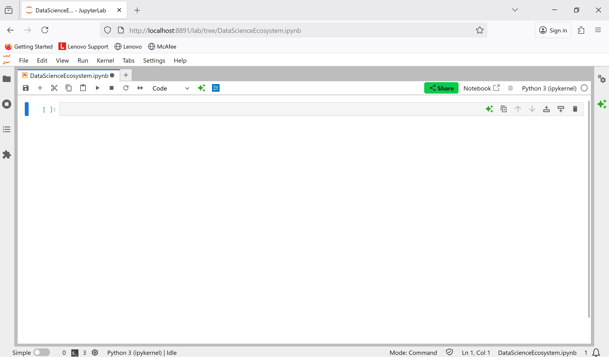

### 🖼 2. Title Cell
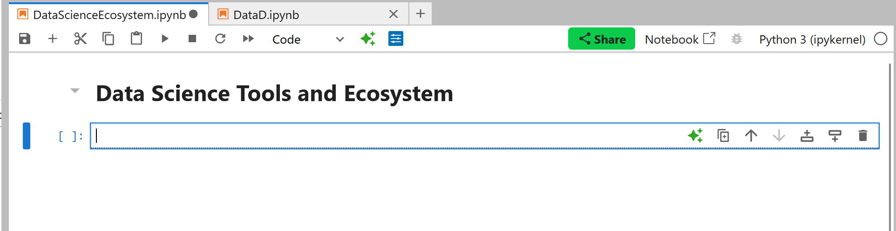

### 🖼 3. Introduction Cell
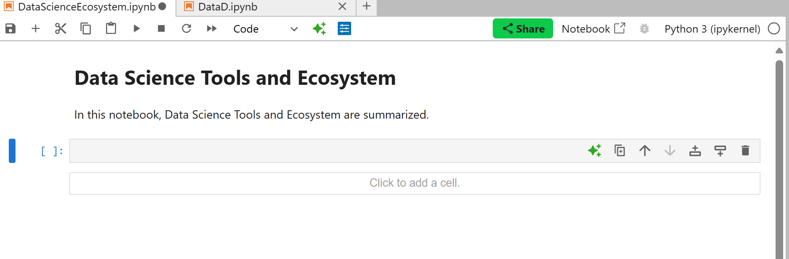

### 🖼 4. Languages in Data Science
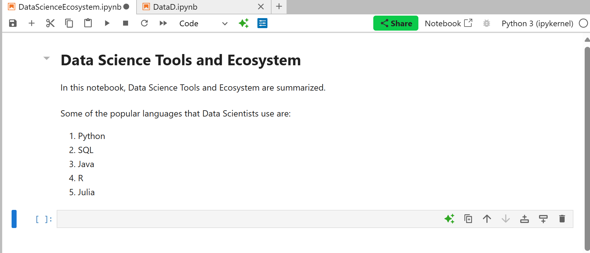

### 🖼 5. Common Libraries Used
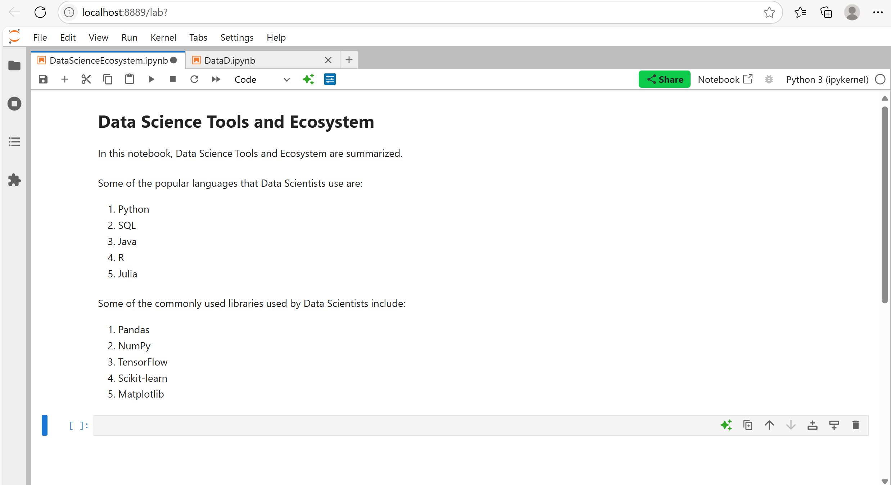

### 🖼 6. Data Science Tools Table
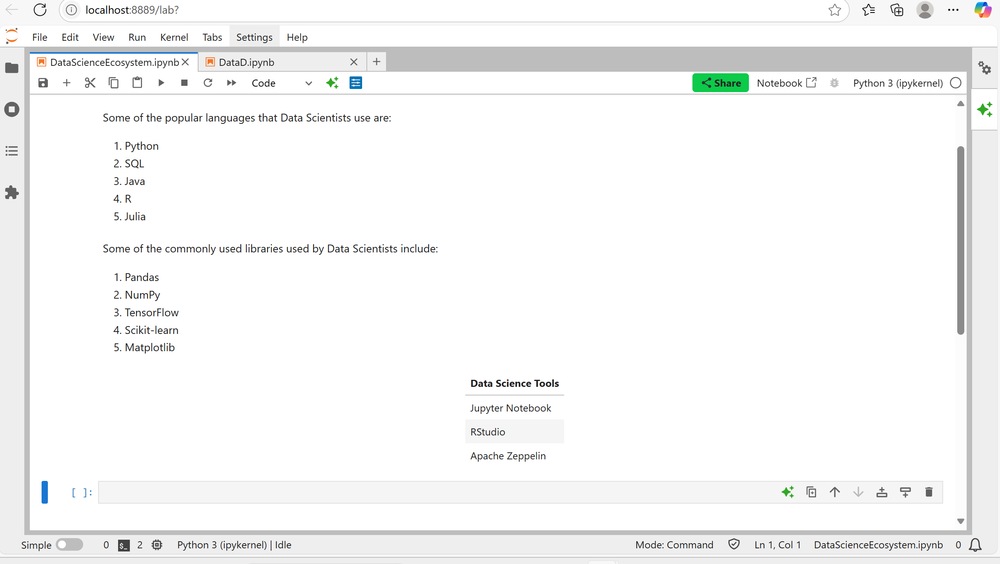

### 🖼 7. Arithmetic Heading
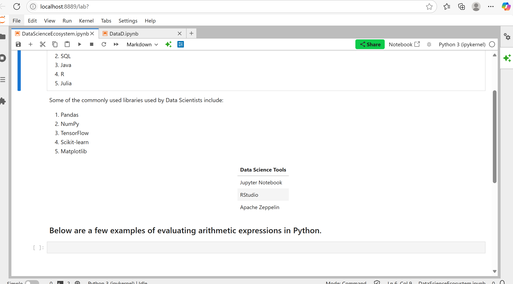

### 🖼 8. Multiply & Add Expression
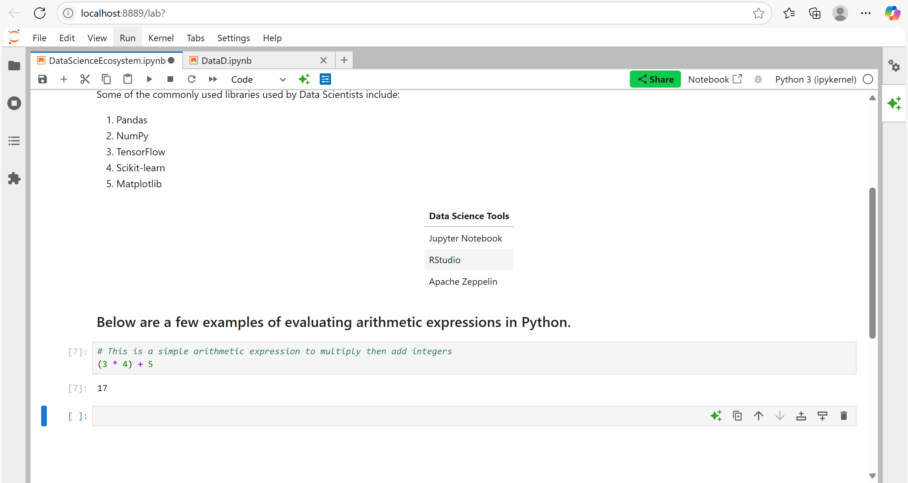

### 🖼 9. Time Conversion Logic
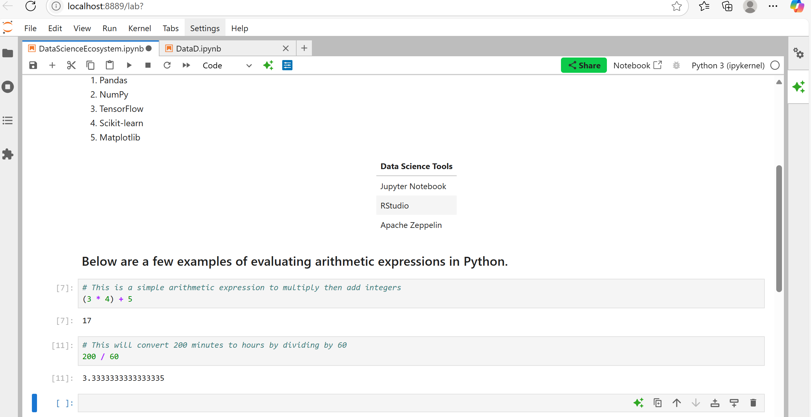

### 🖼 10. Objectives List
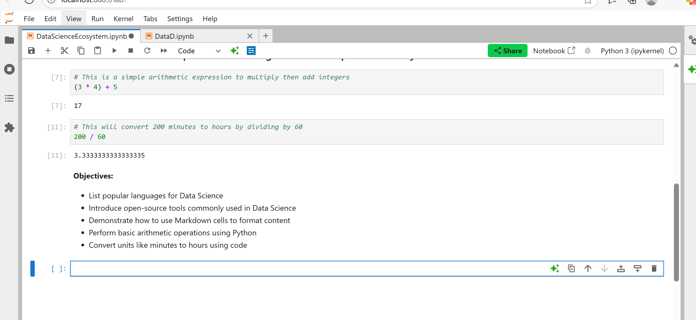

### 🖼 11. Author Name Cell
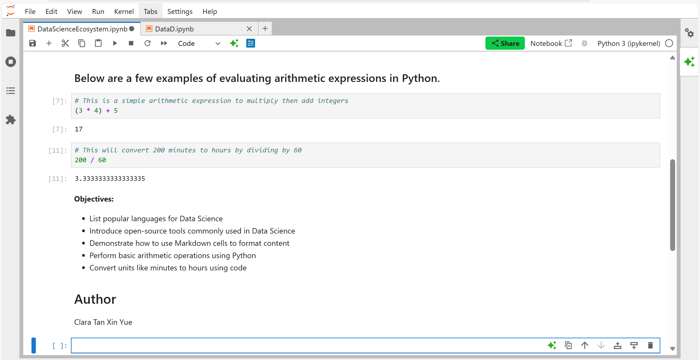

---

## 👩‍💻 Author
**Clara Tan**

Feel free to view the notebook [here](https://github.com/Claratxy/DataScienceAssignments/blob/81a00bb05125b7cdf1755405797382bd31b0f747/DataScienceEcosystem/DataScienceEcosystem.ipynb).

